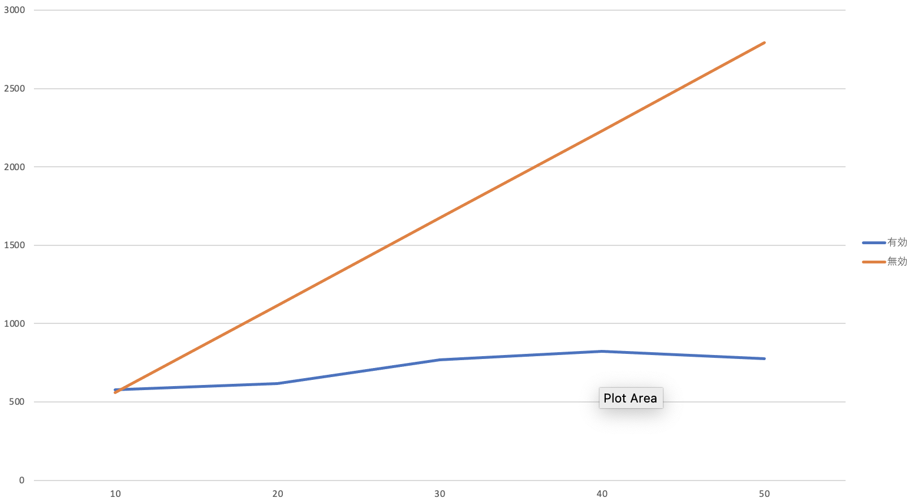

# Spring virtual thread demo
The difference between virtual thread enabled and disabled. 

## Description
We set max tomcat threads=10 in application properties.

## System environment

### OS
```zsh
 % system_profiler SPHardwareDataType  
Hardware:

    Hardware Overview:

      Model Name: MacBook Pro
      Model Identifier: MacBookPro16,2
      Processor Name: Quad-Core Intel Core i5
      Processor Speed: 2 GHz
      Number of Processors: 1
      Total Number of Cores: 4
      L2 Cache (per Core): 512 KB
      L3 Cache: 6 MB
      Hyper-Threading Technology: Enabled
      Memory: 16 GB
```

### java
```zsh 
% java -version
openjdk version "21.0.1" 2023-10-17 LTS
OpenJDK Runtime Environment Temurin-21.0.1+12 (build 21.0.1+12-LTS)
OpenJDK 64-Bit Server VM Temurin-21.0.1+12 (build 21.0.1+12-LTS, mixed mode)
```
### ApacheBench
```zsh
% ab -V
This is ApacheBench, Version 2.3 <$Revision: 1903618 $>
```

## build application

```zsh
./gradlew build
```

## Lunch application without virtual thread

### Lunch application

```zsh
java -jar build/libs/spring-virtual-thread-demo-0.0.1-SNAPSHOT.jar
```

### Send requests and measure the average response time

```zsh
% ab -c 10 -n 100 "localhost:8080/?sleep=500" | grep "Time per request: .*(mean)"
ab -c 20 -n 100 "localhost:8080/?sleep=500" | grep "Time per request: .*(mean)"
ab -c 30 -n 100 "localhost:8080/?sleep=500" | grep "Time per request: .*(mean)"
ab -c 40 -n 100 "localhost:8080/?sleep=500" | grep "Time per request: .*(mean)"
ab -c 50 -n 100 "localhost:8080/?sleep=500" | grep "Time per request: .*(mean)"

Time per request:       559.088 [ms] (mean)
Time per request:       1116.575 [ms] (mean)
Time per request:       1673.774 [ms] (mean)
Time per request:       2230.960 [ms] (mean)
Time per request:       2792.416 [ms] (mean)
```

## Lunch application with virtual thread

### Lunch application

```zsh
java -jar build/libs/spring-virtual-thread-demo-0.0.1-SNAPSHOT.jar --spring.threads.virtual.enabled=true
```

### Send requests and measure the average response time

```zsh
% ab -c 10 -n 100 "localhost:8080/?sleep=500" | grep "Time per request: .*(mean)"
ab -c 20 -n 100 "localhost:8080/?sleep=500" | grep "Time per request: .*(mean)"
ab -c 30 -n 100 "localhost:8080/?sleep=500" | grep "Time per request: .*(mean)"
ab -c 40 -n 100 "localhost:8080/?sleep=500" | grep "Time per request: .*(mean)"
ab -c 50 -n 100 "localhost:8080/?sleep=500" | grep "Time per request: .*(mean)"

Time per request:       576.372 [ms] (mean)
Time per request:       618.027 [ms] (mean)
Time per request:       768.072 [ms] (mean)
Time per request:       824.684 [ms] (mean)
Time per request:       777.636 [ms] (mean)
```

## The result for virtual thread


